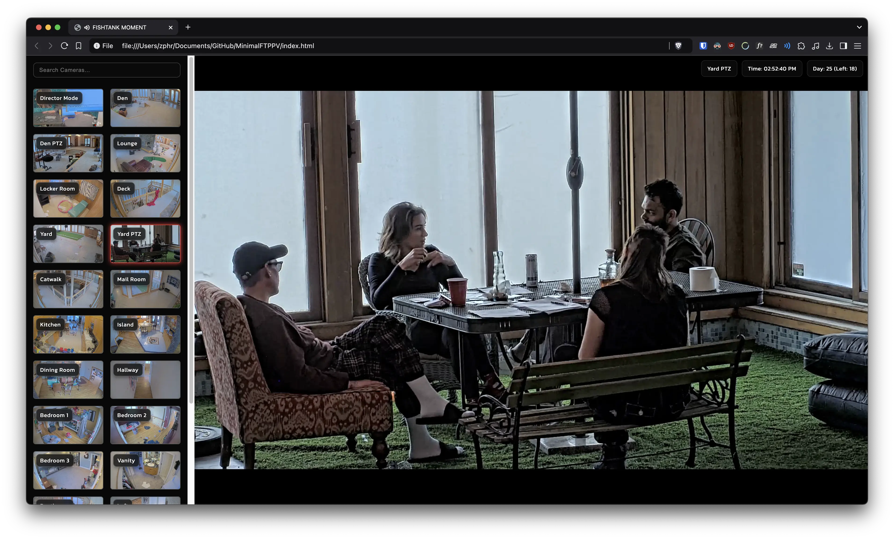

# **MinimalFTPPV**  
Minimal UI for [fishtank.live](https://fishtank.live), uses **[ppv.land](https://ppv.land/ft)'s playlist**.  

Currently supports **desktop browsers only**.

---

## **Getting Started**

### **Prerequisites**
- **Node.js**: Ensure you have **Node.js v23.2.0** or above installed. [Download Node.js](https://nodejs.org/)

### **Installation**

1. **Install dependencies**:  
    <code>npm install fluent-ffmpeg</code>

2. **Start the thumbnail server**:  
    <code>node server.js</code>

3. **Open the UI**:  
   Open the `index.html` file in your browser.  

---

## **Preview**  
### Desktop View:  

---

Feel free to contribute or report issues.